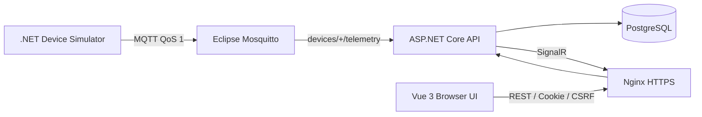

# IoT Device Monitor

以 ASP.NET Core、Vue 3、PostgreSQL、MQTT、SignalR 與 Docker Compose 建立的完整 IoT 設備監控作品。系統接收 REST 或 MQTT 遙測、依可設定閾值產生告警，並將最新設備狀態即時推送到 RWD 管理介面。

這個 repository 採用人工階段閘門完成開發：每一階段都先實作、測試、由使用者審查，再提交 Git。完整決策與驗證紀錄位於 [`docs/PROGRESS.md`](docs/PROGRESS.md)。

## 作品重點

- ASP.NET Core 10 Web API、EF Core 10、PostgreSQL migration 與一致的 Problem Details。
- Vue 3、TypeScript、Vite、Vue Router，以及桌面／平板／手機 RWD。
- MQTT QoS 1 遙測接收、設備模擬器、payload 驗證、重連與基本 message ID 去重。
- 依最近 30 秒遙測判定設備運作狀態，並支援明確設定同 Wi-Fi 手機連入本機 MQTT broker。
- 溫濕度 Warning／Critical 告警、查詢、篩選及冪等確認。
- SignalR 即時遙測與告警；斷線後自動重連並以 REST 補抓缺口。
- Cookie Authentication、CSRF、Admin／Operator／Viewer 授權、CORS 白名單、rate limiting 與安全標頭。
- API、Vue/Nginx 與模擬器多階段 Dockerfile；完整 Compose health check、啟動相依性、持久化與非 root 執行。
- 後端整合測試、前端元件／資料存取測試，以及跨 HTTPS、Authentication、SignalR、MQTT、PostgreSQL 的 smoke test。

## 系統架構



瀏覽器只連到負責 TLS termination 的 Nginx HTTPS 入口；API 不直接發布到 host。PostgreSQL 與 MQTT 的開發 port 預設僅綁定 `127.0.0.1`；只有同 Wi-Fi 設備測試時才明確將 MQTT 綁到電腦的私有 IPv4。

## 技術組合

| 區域 | 技術 |
|---|---|
| Backend | .NET 10、ASP.NET Core Controllers、SignalR |
| Data | EF Core 10、Npgsql、PostgreSQL 17 |
| Messaging | MQTTnet、Eclipse Mosquitto 2、QoS 1 |
| Frontend | Vue 3、TypeScript、Vite、Vue Router |
| Security | Secure Cookie、CSRF、角色授權、CORS、rate limiting、CSP |
| Delivery | Docker Compose、multi-stage builds、Nginx reverse proxy |
| Quality | xUnit、WebApplicationFactory、Vitest、ESLint、vue-tsc |

## 一組指令啟動完整系統

前置需求：Docker Desktop、Docker Compose v2，以及可用的 `8080`、`8443`、`5433`、`1883` 本機 port。

1. 建立不納入 Git 的設定：

   ```powershell
   Copy-Item .env.example .env
   ```

2. 編輯 `.env`，至少更換以下三個範例密碼：

   - `POSTGRES_PASSWORD`
   - `MQTT_PASSWORD`
   - `BOOTSTRAP_ADMIN_PASSWORD`

   Admin 密碼必須為 12–128 字元，包含英文大寫、小寫、數字與符號。不要把 `.env`、密碼或 Cookie 提交到 Git。

3. 建置、啟動並等待所有服務健康：

   ```powershell
   docker compose up -d --build --wait
   ```

4. 開啟 [https://localhost:8443](https://localhost:8443)，接受本機自簽憑證警告，使用 `.env` 的 `BOOTSTRAP_ADMIN_USERNAME` 與 `BOOTSTRAP_ADMIN_PASSWORD` 登入。

全新 volume 啟動時會自動套用 migration、建立一次性 Bootstrap Admin、建立三台 `sim-device-*` 展示設備，並由模擬器透過 MQTT 持續送出真實遙測。Bootstrap 不會覆寫既有帳號或密碼。

## 驗證與操作

查看服務狀態與日誌：

```powershell
docker compose ps
docker compose logs -f api web simulator
```

執行完整 smoke test（PowerShell 7）：

```powershell
pwsh ./scripts/smoke-test.ps1
```

Smoke test 會驗證：

- Vue 靜態入口與 CSP；
- process/database health；
- HTTPS Cookie 登入與 CSRF；
- 受保護的設備、告警 API；
- 已驗證身分的 SignalR negotiation；
- 模擬器資料經 MQTT 寫入 PostgreSQL 並由 REST 查到。

停止並保留資料：

```powershell
docker compose down
```

`docker compose down --volumes` 會永久刪除本專案的 PostgreSQL、Mosquitto 與 Cookie key ring 資料，只能在確定不需要資料時執行。

## 角色與主要功能

| 功能 | Viewer | Operator | Admin |
|---|---:|---:|---:|
| 查看設備、遙測與告警 | ✓ | ✓ | ✓ |
| 確認告警 |  | ✓ | ✓ |
| REST 寫入遙測 |  | ✓ | ✓ |
| 建立、啟用或停用設備 |  |  | ✓ |
| 建立及列出使用者 |  |  | ✓ |

主要 API：

| Method | Path | 說明 |
|---|---|---|
| `POST` | `/api/auth/login` | Cookie 登入。 |
| `GET/POST` | `/api/devices` | 查詢／建立設備。 |
| `GET/POST` | `/api/devices/{id}/telemetry` | 查詢／寫入遙測。 |
| `GET` | `/api/alerts` | 分頁篩選告警。 |
| `PATCH` | `/api/alerts/{id}/acknowledge` | 確認告警。 |
| `POST` | `/hubs/monitoring/negotiate` | 已登入使用者的 SignalR negotiation。 |

容器模式的 OpenAPI JSON 位於 `https://localhost:8443/openapi/v1.json`。

## MQTT 契約

Topic：

```text
devices/{externalDeviceId}/telemetry
```

Payload：

```json
{
  "messageId": "0c2fa900-cdba-44bd-94ec-167a7533de49",
  "temperatureCelsius": 24.8,
  "humidityPercent": 52.4,
  "recordedAtUtc": "2026-10-01T02:00:00Z"
}
```

詳細 topic、驗證規則、去重與重連策略請參考 [`docs/MQTT_DEVELOPMENT.md`](docs/MQTT_DEVELOPMENT.md)。

管理員啟用狀態與設備連線狀態分開顯示。有效遙測寫入後，設備在 30 秒內顯示為運作中；停止回報後會自動轉為離線。同一 Wi-Fi 的手機 MQTT Client 驗證步驟也位於上述文件。

## 本機品質檢查

```powershell
dotnet format IoTMonitor.slnx --verify-no-changes --no-restore
dotnet build IoTMonitor.slnx -c Release --no-restore
dotnet test IoTMonitor.slnx -c Release --no-build --no-restore

Set-Location src/iot-monitor-web
npm run type-check
npm run lint
npm run test
npm run build
npm audit
```

PostgreSQL 完整整合測試需要設定 `IOT_MONITOR_TEST_CONNECTION_STRING`；測試只建立並刪除隨機命名的 `iot_monitor_tests_*` 資料庫。

## 安全與部署界線

- `.env.example` 只有假值；實際 `.env` 被 Git 忽略。
- 自製容器以非 root 執行、移除 Linux capabilities、使用唯讀 root filesystem 及 `no-new-privileges`。
- Data Protection key ring 位於獨立 Docker volume，容器重建後登入 Cookie 仍可解密。
- Nginx 使用建置時產生的 localhost 自簽憑證，只適合本機展示；正式環境應由受信任的入口負責 TLS。
- Compose 透過環境變數提供本機秘密；正式環境應改用平台 secret manager，並加密保護 Data Protection keys。
- 自動 migration 與 demo seed 都由設定控制，預設 appsettings 關閉、僅 Compose 展示環境啟用。
- SignalR 與 MQTT message ID 去重目前以單一 API 執行個體為假設；橫向擴充需加入 backplane 與分散式去重。
- MQTT 區網測試仍使用未加密的 1883，只能在可信任的私人網路短暫啟用；正式設備接入必須改用 TLS、個別設備憑證或帳密及 topic ACL。

## Repository 結構

```text
src/
  IoTMonitor.Api/              ASP.NET Core API、MQTT worker、SignalR
  IoTMonitor.DeviceSimulator/  MQTT 設備模擬器
  iot-monitor-web/             Vue 3 前端與 Nginx
tests/
  IoTMonitor.Api.Tests/        單元與 PostgreSQL 整合測試
infra/
  mosquitto/                   Broker 設定
scripts/
  smoke-test.ps1               完整容器 smoke test
docs/                          架構、開發與階段交接文件
```

## 延伸文件

- [完整容器操作](docs/CONTAINER_DEPLOYMENT.md)
- [API 與 migration](docs/API_DEVELOPMENT.md)
- [Authentication 與安全](docs/AUTHENTICATION.md)
- [Vue 前端](docs/FRONTEND_DEVELOPMENT.md)
- [MQTT 與模擬器](docs/MQTT_DEVELOPMENT.md)
- [告警與 SignalR](docs/ALERTS_REALTIME.md)
- [實作階段與驗收條件](docs/IMPLEMENTATION_PLAN.md)
- [進度與 AI 交接](docs/PROGRESS.md)
